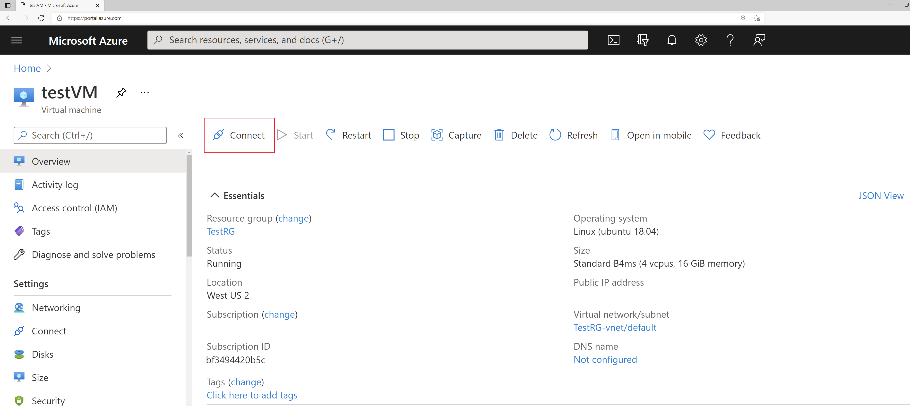

# 데모: Azure Bastion을 사용하여 Linux VM에 대한 SSH 연결 만들기

이 데모에서는 Azure Portal과 사용자 이름 및 암호를 사용하여 Azure Virtual Network에서 Linux VM에 대한 SSH 연결을 만듭니다. Azure Bastion을 사용하면 VM에 클라이언트, 에이전트 또는 추가 소프트웨어가 필요하지 않습니다.

## 전제 조건

이 데모를 완료하려면 Linux VM을 포함하는 Azure Virtual Network가 필요합니다. Azure VM 만들기에 대한 자세한 내용은 [데모: 포털에서 가상 머신 만들기](https://github.com/MicrosoftLearning/AZ-120KO-Planning-and-Administering-Microsoft-Azure-for-SAP-Workloads/blob/master/Demos/demo-create-virtual-machine-portal.md) 또는 [데모: PowerShell을 사용하여 가상 머신 만들기](https://github.com/MicrosoftLearning/AZ-120KO-Planning-and-Administering-Microsoft-Azure-for-SAP-Workloads/blob/master/Demos/demo-create-virtual-machine-powershell.md)를 참조하세요.

VM이 있는 가상 네트워크용 Azure Bastion 호스트를 설정했는지 확인합니다. 자세한 내용은 [Azure Bastion 호스트 만들기](https://docs.microsoft.com/azure/bastion/tutorial-create-host-portal)를 참조하세요. Bastion 서비스가 가상 네트워크에 프로비저닝되고 배포되면 이 서비스를 사용하여 이 가상 네트워크의 모든 VM에 연결할 수 있습니다. 

### 필요한 역할

연결하려면 다음 역할이 필요합니다.

* 가상 머신에 대한 읽기 권한자 역할
* 가상 머신의 개인 IP를 사용하는 NIC에 대한 읽기 권한자 역할
* Azure Bastion 리소스에 대한 읽기 권한자 역할

### 포트

SSH를 통해 Linux VM에 연결하려면 VM에서 다음 포트가 열려 있어야 합니다.

* 인바운드 포트: SSH(22) ***또는***
* 인바운드 포트: 사용자 지정 값(Azure Bastion을 통해 VM에 연결할 때 이 사용자 지정 포트를 지정해야 함)

> **참고:** 사용자 지정 포트 값을 지정하려면 표준 SKU를 사용하여 Azure Bastion을 구성해야 합니다. 기본 SKU에서는 사용자 지정 포트를 지정할 수 없습니다. 표준 SKU는 현재 미리 보기 상태입니다.

## 연결 중 사용자 이름 및 암호 사용

1. [Azure Portal](https://portal.azure.com)을 엽니다. 연결하려는 가상 머신으로 이동하여 **연결**을 선택한 다음 드롭다운에서 **Bastion**을 선택합니다.

    

1. **Bastion 사용**을 선택합니다. 가상 네트워크에 대해 Bastion을 프로비전하지 않은 경우 [Bastion 구성](https://docs.microsoft.com/azure/bastion/quickstart-host-portal)을 참조하세요.
1. **Azure Bastion을 사용하여 연결** 페이지에서 **사용자 이름** 및 **암호**를 입력합니다.

    

1. **연결**을 선택하여 VM에 연결합니다.