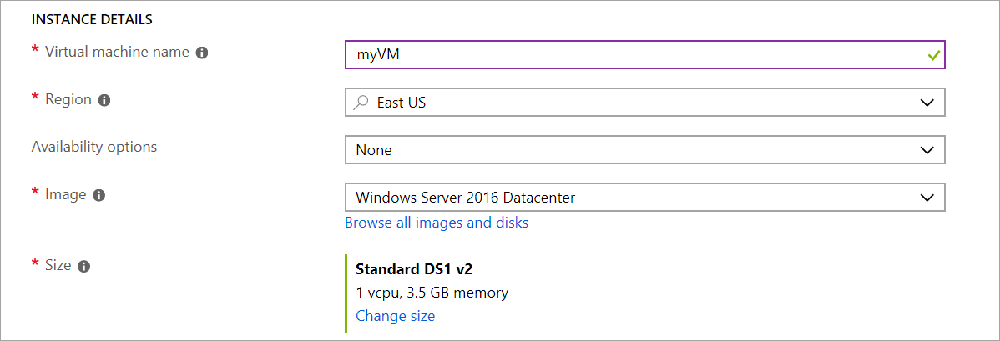

# <a name="demonstration-create-a-virtual-machine-in-the-portal"></a>데모: 포털에서 가상 머신 만들기

이 데모에서는 포털에서 Windows 가상 머신을 만들고 해당 가상 머신에 액세스해보겠습니다.

## <a name="create-the-virtual-machine"></a>가상 머신 만들기

1. Azure Portal의 왼쪽 위 모서리에서 **리소스 만들기** 를 선택합니다.
2. Azure Marketplace 리소스 목록 위의 검색 상자에서 **Windows Server 2016 Datacenter** 를 검색합니다. 이미지를 찾은 후 **만들기** 를 클릭합니다.
3. **기본** 탭의 **프로젝트 세부 정보** 아래에서 올바른 구독이 선택되어 있는지 확인한 다음, 리소스 그룹 **새로 만들기** 를 선택합니다. 이름으로 *myResourceGroup* 을 입력합니다.

    

4. **인스턴스 세부 정보** 아래에서 **가상 머신 이름** 에 *myVM* 을 입력하고 **위치** 에 *미국 동부* 를 선택합니다. 다른 기본값을 그대로 둡니다.

    

5. **관리자 계정** 에서 *azureuser* 와 같은 사용자 이름 및 암호를 입력합니다. 암호는 12자 이상이어야 하며 정의된 복잡성 요구 사항을 충족해야 합니다.

    

6. **인바운드 포트 규칙** 에서 **선택한 포트 허용** 을 선택한 다음, 드롭다운에서 **RDP(3389)** 및 **HTTP** 를 선택합니다.

    

7. **관리** 탭으로 이동하여 **모니터링** 에서 부팅 진단을 **해제** 합니다. 이렇게 하면 유효성 검사 오류가 제거됩니다. 
8. 나머지 기본값을 그대로 둔 다음, 페이지의 아래에서 **검토 + 만들기** 단추를 선택합니다. 유효성 검사를 기다린 다음 **만들기** 를 클릭합니다. 

    

## <a name="connect-to-the-virtual-machine"></a>가상 머신에 연결

가상 머신에 대한 원격 데스크톱 연결을 만듭니다. 이러한 지침은 Windows 컴퓨터에서 VM에 연결하는 방법을 알려줍니다. Mac 에서 Mac App Store 에서 RDP 클라이언트를 설치해야 합니다.

1. 가상 머신 속성 페이지에서 **연결** 단추를 선택합니다.
2. **가상 머신에 연결** 페이지에서, 3389 포트를 통해 DNS 이름으로 연결하는 기본 옵션을 유지하고 **RDP 파일 다운로드** 를 클릭합니다.
3. 다운로드한 RDP 파일을 열고 메시지가 표시되면 **연결** 을 선택합니다.
4. **Windows 보안** 창에서 **추가 선택 사항** 및 **다른 계정 사용** 을 차례로 선택합니다. 사용자 이름을 localhost\username으로 입력하고 가상 머신에서 만든 암호를 입력한 다음 **확인** 을 선택합니다.
5. 로그인 프로세스 중에 인증서 경고가 나타날 수 있습니다. **예** 또는 **계속** 을 선택하여 연결을 만듭니다.

## <a name="install-web-server"></a>웹 서버 설치

VM이 작동하는지 확인하려면 IIS 웹 서버를 설치합니다. VM에서 PowerShell 프롬프트를 열고 다음 명령을 실행합니다.

```PowerShell
Install-WindowsFeature -name Web-Server -IncludeManagementTools
```

여기까지 마쳤으면 VM에 대한 RDP 연결을 닫습니다.

## <a name="view-the-iis-welcome-page"></a>IIS 시작 페이지 보기

Portal에서 VM을 선택하고 VM의 개요 창에서 공용 IP 주소 오른쪽의 **클릭하여 복사** 단추를 사용하여 해당 주소를 복사한 다음 브라우저 탭에 붙여 넣습니다. 기본 IIS 시작 페이지가 열립니다.


## <a name="clean-up-resources"></a>리소스 정리

>**참고:** 더 이상 필요하지 않은 경우 리소스 그룹, 가상 머신 및 모든 관련 리소스를 삭제할 수 있습니다. 삭제하려면 가상 머신의 리소스 그룹을 선택하고 **삭제** 를 선택한 다음, 삭제할 리소스 그룹의 이름을 확인합니다.