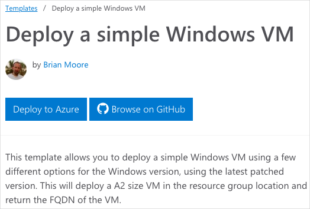
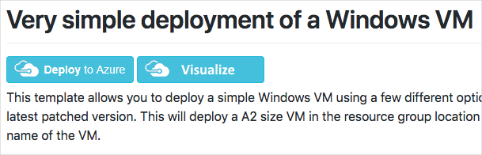

# <a name="demonstration-explore-quickstart-templates"></a>데모: 빠른 시작 템플릿 탐색

## <a name="explore-the-gallery"></a>갤러리 살펴보기

1. You could start by browsing to the <bpt id="p1">[</bpt>Azure Quickstart Templates gallery<ept id="p1">](https://azure.microsoft.com/resources/templates?azure-portal=true)</ept>. In the gallery you will find a number of popular and recently updated templates. These templates work with both Azure resources and popular software packages.
2. 사용 가능한 다양한 유형의 템플릿을 탐색합니다.
3. 적합한 템플릿이 있습니까?

## <a name="explore-a-template"></a>템플릿 살펴보기

1. <a href="https://azure.microsoft.com/resources/templates/101-vm-simple-windows?azure-portal=true" target="_blank"><span style="color: #0066cc;" color="#0066cc">간단한 Windows VM 배포</span></a> 템플릿을 우연히 발견했다고 가정하겠습니다.

    

    >**참고:**
    >- **Azure에 배포** 단추를 사용하면 원하는 경우 Azure Portal을 통해 직접 템플릿을 배포할 수 있습니다.
    >- Scroll-down to the Use the template <bpt id="p1">**</bpt>PowerShell<ept id="p1">**</ept> code. You will need the <bpt id="p1">**</bpt>TemplateURI<ept id="p1">**</ept> in the next demo. <bpt id="p1">**</bpt>Copy the value<ept id="p1">**</ept>. 

```
https://raw.githubusercontent.com/Azure/azure-quickstart-templates/master/101-vm-simple-windows/azuredeploy.json
```

2. **Browse on GitHub**(GitHub에서 찾아보기)를 클릭하여 GitHub에 있는 템플릿의 소스 코드로 이동합니다.

    

3. Notice from this page you can also <bpt id="p1">**</bpt>Deploy to Azure<ept id="p1">**</ept>. Take a minute to view the Readme file. This helps to determine if the template is for you.  

4. **시각화**를 클릭하여 **Azure Resource Manager 시각화**로 이동합니다.

    

5. VM, 스토리지 계정 및 네트워크 리소스 등 배포를 구성하는 리소스를 확인합니다.
6. [Azure 빠른 시작 템플릿 갤러리](https://azure.microsoft.com/resources/templates?azure-portal=true)를 탐색하여 시작할 수 있습니다.
7. **SimpleWinVM**이라는 레이블이 지정된 VM 리소스를 클릭합니다.

    

8. VM 리소스를 정의하는 소스 코드를 검토합니다.

    * 리소스 종류는 `Microsoft.Compute/virtualMachines`입니다.
    * 해당 위치 또는 Azure 지역은 `location`이라는 템플릿 매개 변수를 통해 제공됩니다.
    * VM 크기는 **Standard_A2**입니다.
    * 컴퓨터 이름은 템플릿 변수에서 읽고, VM의 사용자 이름과 암호는 템플릿 매개 변수에서 읽습니다.

9. 자주 사용하는 템플릿과 최근에 업데이트된 템플릿 다수가 갤러리에 표시됩니다.

>**참고:** 다음 데모에서 템플릿 링크가 필요합니다.