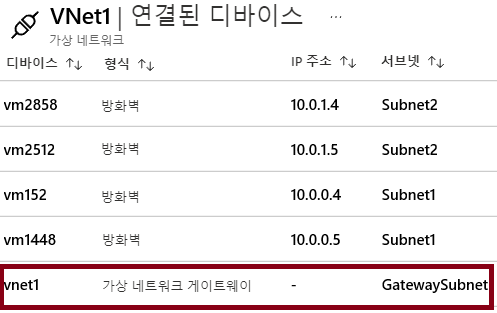

# 데모: VNet 간 연결 살펴보기

>**참고**: 이 데모는 서브넷이 있는 가상 네트워크 2개를 사용하는 경우 가장 효율적으로 작동합니다. 모든 단계는 Portal에서 수행합니다. 

## 게이트웨이 서브넷 블레이드 살펴보기

1. 가상 네트워크 중 하나에 대해 **서브넷** 블레이드를 선택합니다.
1. **+ 게이트웨이 서브넷**을 선택합니다.

    - 서브넷의 이름은 변경할 수 없습니다.  
    - 게이트웨이 서브넷의 **주소 범위**를 확인합니다. 주소는 가상 네트워크의 주소 공간에 포함되어 있어야 합니다. 

1. 각 가상 네트워크에는 게이트웨이 서브넷이 필요합니다. 
1. 게이트웨이 서브넷 추가 페이지를 닫습니다. 변경 내용을 저장할 필요는 없습니다.

## 연결된 디바이스 블레이드 살펴보기

1. 가상 네트워크에서 **연결된 디바이스** 블레이드를 선택합니다.
2. 배포된 게이트웨이 서브넷은 연결된 디바이스 목록에 표시됩니다.

## 가상 네트워크 게이트웨이 추가 방법 살펴보기

1. **가상 네트워크 게이트웨이**를 검색합니다.
2. **+ 추가**를 클릭합니다.
3. 가상 네트워크 게이트웨이의 각 설정을 검토합니다.
4. 정보 아이콘을 사용하여 설정에 대해 자세히 알아봅니다.
5. **게이트웨이 유형**, **VPN 유형** 및 **SKU**를 확인합니다. 
6. **공용 IP 주소**가 필요합니다.
7. 각 가상 네트워크에는 가상 네트워크 게이트웨이가 필요함을 명심하세요. 
8. **가상 네트워크 게이트웨이 추가** 페이지를 닫습니다. 변경 내용을 저장할 필요는 없습니다. 

## 가상 네트워크 간의 연결 추가 방법 살펴보기

1. **연결**을 검색합니다.
2. **+ 추가**를 클릭합니다.
3. **연결 유형**은 VNet간, IPsec(사이트 간) 또는 ExpressRoute일 수 있습니다.
4. **확인** 단추를 클릭할 수 있도록 충분한 정보를 제공합니다.
5. **설정** 페이지에서 두 개의 서로 다른 가상 네트워크를 선택해야 합니다.
6. **양방향 연결 설정** 체크박스에서 도움말 정보를 읽어보십시오.
7. **공유 키(PSK)** 정보를 확인합니다.
8. **연결 추가** 페이지를 닫습니다. 변경 내용을 저장할 필요는 없습니다. 
